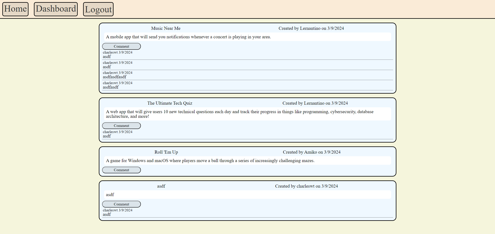
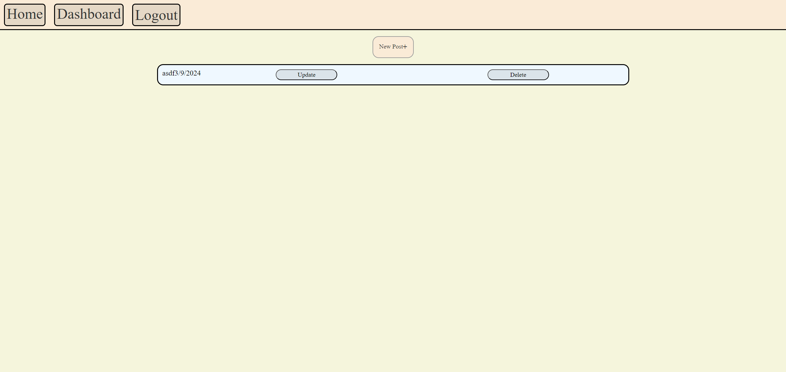
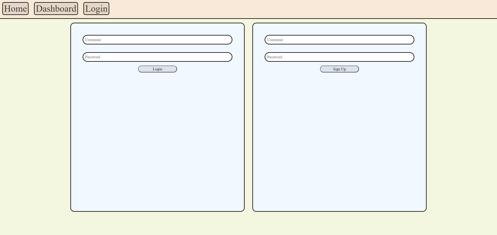

# Tech-Blog  

## Description

This program allows you to create and view other people's blog posts!

## Table of Contents

- [Installation](#installation)
- [Usage](#usage)
- [Screen-Shot](#screen-shot)
- [License](#license)
- [Contributing](#contributing)
- [Questions](#questions)

## Installation

If you intend to git clone this repository, make sure to have Node.js and MySQL installed and set up properly. Then run the following commands in your integrated terminal:
```bash
npm i
mysql -u "your username" -p
You will be prompted to enter your password. After that, run:
exit
npm run seed
npm start
```

## Usage

 1. [Website Link](https://tech-blog-ct-4cf92c1dd72a.herokuapp.com/)
 2. Login or signup.
 3. Navigate to the dashboard, then create a post.
 4. Navigate back to the home and see your new post. Notice that you can also comment on each post.

## Screen-Shot

</br>
</br>


## License

This project is licensed under the MIT License. See the [MIT License](https://github.com/charleswt/Tech-Blog/blob/main/LICENSE) file for details.

## Contributing

This project was developed by [Charles Tiffany](https://github.com/charleswt/).

## Questions

If you have any questions or suggestions, please email me at charleswtiffany@gmail.com.